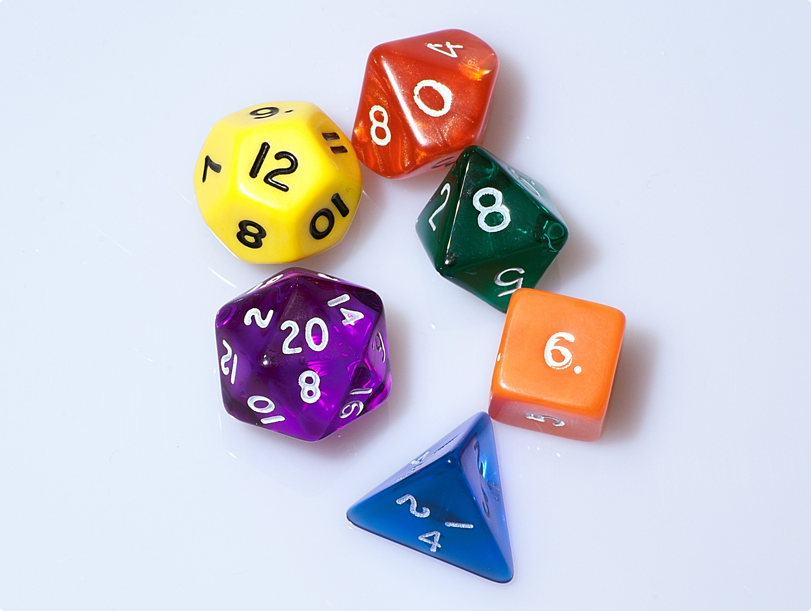

# Prueba específica unidad 4, 5 y 6

> Se evaluará el RAxxx

## 1. Descripción del ejercicio
Desde GameJamIndie SL nos piden ayuda para desarrollar un juego que permita jugar a los dados. 

La particularídad de este juego es que debe permitir jugar con varios tipos de dados y a varios tipos de juegos.

### Tipos de dados
 
- El dado de cuatro caras suele ser un tetraedro regular. 
- El dado de seis caras es un cubo (o lo que es lo mismo: un hexaedro regular). 
- El dado de ocho caras es un octaedro regular. 
- El dado de doce caras es un dodecaedro regular. 
- El dado de veinte caras es un icosaedro regular. 
- El dado de diez caras es un trapezoedro pentagonal.

### Tipos de juegos
Los juegos son los siguientes: 

#### a. Sencillo. 
**Número de jugadores**: 2 jugadores mínimo.   
**Número de rondas**: Puede establecerse un límite o dejar hasta que se cumpla la condición de victoria.   
**Número de dados**: 3   
**Tipo de dados**: Se puede elegir entre varios tipos de dados.   
**¿Cómo se juega?**: Se tiran los dados. Si todos salen con el mismo valor el jugador habrá ganado. Hay que tener en cuenta que el tipo de dado hará más larga la partida.  
**Quién gana**: aquel que consigue sacar los 3 dados con el mismo valor.

#### b. Chicago.
**Número de jugadores**: 3 jugadores mínimo   
**Número de rondas**: 11 rondas.   
**Número de dados**: 2.   
**Tipo de dados**: Dado de seis caras   
**¿Cómo se juega?**: En cada ronda hay una puntuación objetivo que comienza por 2 en la primera y va subiendo uno a uno hasta llegar al objetivo de 12 en la ronda número 11. Cada jugador debe tirar dos dados y el objetivo es lograr la puntuación de la ronda sumando los números de ambos dados. Si un jugador consigue el objetivo, se le anotará la puntuación. Si por el contrario no lo consigue, no se anota nada en esta ronda y pasa el turno al siguiente jugador.   
**Quién gana**: gana quien más puntos tenga al final de las 11 rondas.

#### c. Barco Capitán Tripulación 
**Número de jugadores**: 2 jugadores mínimo  
**Número de rondas**: 3 tiradas x ronda. Tiene que establecerse un número total de rondas o condición de victoria, que puede ser un límite total de puntos.         
**Número de dados**: 5.  
**Tipo de dados**: Dado de seis caras    
**¿Cómo se juega?**: Cada jugador debe conseguir un Barco (6), un Capitán (5) y una Tripulación (4). Para lograrlo tiene 3 tiradas. Comienza tirando los 5 dados. Si consigue un 6 en la primera tirada lo aparta (ya tiene el Barco) y continua tirando los otros cuatro dados para intentar conseguir un Capitán (5) y una Tripulación (4). Si en una sola tirada le salen un Barco (6) y un Capitán (5) puede guardar los dos, pero deben ir en orden por lo que si sale un 6 y un 4 solo podrá guardar el 6.
Si consigue el barco, el capitán y la tripulación anotará como puntuación el número que salga en el resto de dados en la última tirada. Esta será la carga y es nuestra puntuación que indicará quien ha ganado el juego.   
**Quién gana**: Gana quien tenga más puntuación al final de las rondas que estipulemos (10 por ejemplo)

Ejemplo: Una ronda de un jugador.
Primera tirada: El jugador saca 6-4-3-3-2 y guarda el barco (6). 
Segunda tirada: Ahora saca 5-4-5-1 y guarda el capitán (5) y la tripulación (4). Podría anotarse 5-1 como carga pero como le queda una tirada, el jugador puede arriesgarse en una tercera tirada para obtener una mayor carga, una puntuación más alta.

### Entrada
Configuración de las clases de forma adecuada para poder jugar a un juego concreto.

### Salida
El programa debe poder configurarse para mostar por un dipositivo de salida (Consola, Archivo, ....) , que va sucediendo en cada ronda de cada jugador, y hacer un resumen al final juego, indicando los puntos conseguidos y el ganador.
 

## 2. ¿Qué se pide?
Desarrollar el programa.
Desarrollar los test que estimes necesarios, para tener un porcentaje algo de cobertura, cercano al 80%.
Implementar 2 de los 3 juegos.

## 3. Procedimiento a seguir
Lo primero que hacemos es identificar las clases, y empezar a realizar sus test unitarios según el proceso TDD.

Podemos identificar la clase Dado..., la clase JuegoDeDados....
Luego las propiedades y los métodos de cada clase.

## 4. Evaluación

## 5. Condiciones de entrega
- El programa debe compilar.
- Disponibilidad de los test.
 

## 4. Bibliografía y ayuda
- [Juegos con dados](https://patapato.es/campamento-patapato-3/) 
- [Refactoring.Guru](https://refactoring.guru/es/)
- 